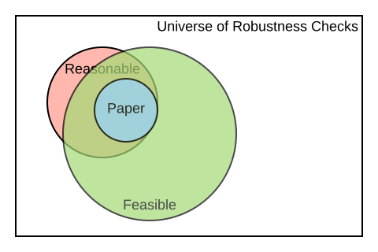

background-image: url("Images/BITSSlogo.png"), url(Images/cega.png)
background-size: contain, 200px
background-position: 50% 100% , 100% 10% 
count:true 

#[BITSS](https://bitss.org)   

<style>

.center2 {
  margin: 0;
  position: absolute;
  top: 50%;
  left: 50%;
  -ms-transform: translate(-50%, -50%);
  transform: translate(-50%, -50%);
}


pre.sourceCode {
    max-height: 200px;
    overflow-y: auto;
}


/*
.remark-slide-number {
  position: inherit;
}

.remark-slide-number .progress-bar-container {
  position: absolute;
  bottom: 0;
  height: 4px;
  display: block;
  left: 0;
  right: 0;
}

.remark-slide-number .progress-bar {
  height: 100%;
  background-color: blue;
}
*/
</style>


```{css, echo=FALSE}
# CSS for including pauses in printed PDF output (see bottom of lecture)
@media print {
  .has-continuation {
    display: block !important;
  }
}

```


```{r setup, include=FALSE}
options(htmltools.dir.version = FALSE)
library(knitr)
opts_chunk$set(
  fig.align="center",  
  fig.height=4, #fig.width=6,
  # out.width="748px", #out.length="520.75px",
  dpi=300, #fig.path='Figs/',
  cache=T ,#, 
  echo=F #warning=F, message=F
  )
library(tidyverse)
library(hrbrthemes)
library(fontawesome)
library(kableExtra)

```


.pull-left[
The Berkeley Initiative for Transparency in the Social Sciences works to improve </br>the credibility of science by </br>
advancing transparency, </br> reproducibility,  rigor, and </br> ethics in research and policy analysis. 

.font130[**Core ACRe**]
  

 Aleks Bogdanoski  
 
 Albert Chae

 Fernando Hoces  de la Guardia
 
 Katie Hoeberling  

Edward Miguel
 
Lars Vilhuber
 
]
.pull-right[ .right[
We are part of the Center for Effective Global Action ([CEGA](https://cega.berkeley.edu/)).   
 </br></br></br></br></br></br></br>


.font130[[**Many Others**](https://bitss.github.io/ACRE/contributions.html#list-of-contributors-guidelines-content-and-source-code)]

CEGA staff

Undergrad and Graduate RAs

Catalysts

Outside Collaborators   
(Researchers, Programmers)
  ]]
 


---
count:false
# Motivation: Computational Reproducibility

<!--- https://imgflip.com/i/5lb28s -->

.pull-right[
.font130[
    Clarebout Principle:
    </br></br></br></br></br></br></br></br></br></br></br></br>

]

]


---

background-image: url("Images/iceberg.jpg")
background-size: 50%
background-position: 100% 50%
count:false
# Motivation: Computational Reproducibility

<!--- https://imgflip.com/i/5lb28s -->

.pull-right[
.font130[
    "Clarebout Principle":
    </br></br></br></br></br></br></br></br></br></br></br></br>
.right[
<cite> Buckheit and D.L. Donoho (1995, [2009](https://academiccommons.columbia.edu/doi/10.7916/D8QZ2MDS/download))</cite>
]
]

]


---
background-image: url("Images/iceberg.jpg")
background-size: 50%
background-position: 100% 50%
count:false
# Motivation: Computational Reproducibility

<!--- https://imgflip.com/i/5lb28s -->

.pull-left[
Every semester, graduate students around **the world** take an Empirical/Applied [`...`] course. A typical assignment consists of reproducing the results of a paper and, possibly, testing the robustness of its results. 


|       Stage       	|                         New Knowledge                        	|
|:-----------------:	|:------------------------------------------------------------:	|
|  </br></br> 	|                                          	|
| </br></br>            	|  	|
| </br></br>           	|  	|
| </br></br>   	|  </br>          	|


]


.pull-right[
.font130[
    "Clarebout Principle":
    </br></br></br></br></br></br></br></br></br></br></br></br>
.right[
<cite> Buckheit and D.L. Donoho (1995, [2009](https://academiccommons.columbia.edu/doi/10.7916/D8QZ2MDS/download))</cite>
]
]

]


---

background-image: url("Images/iceberg.jpg")
background-size: 50%
background-position: 100% 50%
count:false
# Motivation: Computational Reproducibility

<!--- https://imgflip.com/i/5lb28s -->

.pull-left[
Every semester, graduate students around **the world** take an Empirical/Applied [`...`] course. A typical assignment consists of reproducing the results of a paper and, possibly, testing the robustness of its results. 


|       Stage       	|                         New Knowledge                        	|
|:-----------------:	|:------------------------------------------------------------:	|
| Scope </br> (select and verify) 	| Data and code exist?                                         	|
| </br></br>            	|  	|
| </br></br>           	|  	|
| </br></br>   	|  </br>          	|

]


.pull-right[
.font130[
    "Clarebout Principle":
    </br></br></br></br></br></br></br></br></br></br></br></br>
.right[
<cite> Buckheit and D.L. Donoho (1995, [2009](https://academiccommons.columbia.edu/doi/10.7916/D8QZ2MDS/download))</cite>
]
]

]

---

background-image: url("Images/iceberg.jpg")
background-size: 50%
background-position: 100% 50%
count:false
# Motivation: Computational Reproducibility

<!--- https://imgflip.com/i/5lb28s -->

.pull-left[
Every semester, graduate students around **the world** take an Empirical/Applied [`...`] course. A typical assignment consists of reproducing the results of a paper and, possibly, testing the robustness of its results. 


|       Stage       	|                         New Knowledge                        	|
|:-----------------:	|:------------------------------------------------------------:	|
| Scope </br> (select and verify) 	| Data and code exist?                                         	|
| Assess            	| Degree of reproducibility for <br>specific part of the paper 	|
| </br></br>           	|  	|
| </br></br>   	|  </br>          	|


]


.pull-right[
.font130[
    "Clarebout Principle":
    </br></br></br></br></br></br></br></br></br></br></br></br>
.right[
<cite> Buckheit and D.L. Donoho (1995, [2009](https://academiccommons.columbia.edu/doi/10.7916/D8QZ2MDS/download))</cite>
]
]

]

---
background-image: url("Images/iceberg.jpg")
background-size: 50%
background-position: 100% 50%
count:false
# Motivation: Computational Reproducibility

<!--- https://imgflip.com/i/5lb28s -->

.pull-left[
Every semester, graduate students around **the world** take an Empirical/Applied [`...`] course. A typical assignment consists of reproducing the results of a paper and, possibly, testing the robustness of its results. 


|       Stage       	|                         New Knowledge                        	|
|:-----------------:	|:------------------------------------------------------------:	|
| Scope </br> (select and verify) 	| Data and code exist?                                         	|
| Assess            	| Degree of reproducibility for <br>specific part of the paper 	|
| Improve           	| E.g. fixed paths, libraries,<br>added missing files, etc.    	|
| </br></br>   	|  </br>          	|


]


.pull-right[
.font130[
    "Clarebout Principle":
    </br></br></br></br></br></br></br></br></br></br></br></br>
.right[
<cite> Buckheit and D.L. Donoho (1995, [2009](https://academiccommons.columbia.edu/doi/10.7916/D8QZ2MDS/download))</cite>
]
]

]
---
background-image: url("Images/iceberg.jpg")
background-size: 50%
background-position: 100% 50%
count:true  

# Motivation: Computational Reproducibility

<!--- https://imgflip.com/i/5lb28s -->

.pull-left[
Every semester, graduate students around **the world** take an Empirical/Applied [`...`] course. A typical assignment consists of reproducing the results of a paper and, possibly, testing the robustness of its results. 


|       Stage       	|                         New Knowledge                        	|
|:-----------------:	|:------------------------------------------------------------:	|
| Scope </br> (select and verify) 	| Data and code exist?                                         	|
| Assess            	| Degree of reproducibility for <br>specific part of the paper 	|
| Improve           	| E.g. fixed paths, libraries,<br>added missing files, etc.    	|
| Test robustness   	| Results are robust to additional <br>specifications          	|


]


.pull-right[
.font130[
    "Clarebout Principle":
    </br></br></br></br></br></br></br></br></br></br></br></br>
.right[
<cite> Buckheit and D.L. Donoho (1995, [2009](https://academiccommons.columbia.edu/doi/10.7916/D8QZ2MDS/download))</cite>
]
]
]

---
# .font90[**A**ccelerating **C**omputational **Re**producibility: Framework]

## Beyond Binary Judgments    

Reproductions can easily gravitate towards adversarial exchanges.
  - Early career researchers (ECR) have incentives to emphasize unsuccessful reproductions 
  - Original authors have a more senior position and can use it to deter in-depth reproductions from ECRs. 
  - The media also focuses on eye-catching headlines

--


### Our approach: 

We do not want to say 
 > "Paper X is (ir)reproducible"    
 
  
--
We do want to say 
 > "Result Y in paper X has a high/low level of reproducibility according to several reproduction attempts. Moreover, improvements have been made to the original reproduction package, increasing its reproducibility to a higher level" 

---
count:false 

# .font90[**A**ccelerating **C**omputational **Re**producibility: Framework]

## Beyond Binary Judgments    

Reproductions can easily gravitate towards adversarial exchanges.
  - Early career researchers (ECR) have incentives to emphasize unsuccessful reproductions 
  - Original authors have a more senior position and can use it to deter in-depth reproductions from ECRs. 
  - The media also focuses on eye-catching headlines


### Our approach: 

We do not want to say 
 > "Paper X is (ir)reproducible"    
 
  

We do want to say 
 > "Result Y in paper X has a high/low **level** of reproducibility according to **several** reproduction attempts. Moreover, **improvements** have been made to the original reproduction package, **increasing** its reproducibility to a higher level" 

  


---
count: true  
background-image: url(Images/paper-claims.svg)
background-size: 610px
background-position: 75% 0%
  
# ACRe Framework

.pull-left[
.font100[
Each **reproduction attempt** is centered <br>
around scientific **claims** (following [SCORE](https://replicats.research.unimelb.edu.au)). 

One paper can contain several claims. 

Each claim may be supported by various </br>
**display items**: tables, figures & inline results.

A reproduction attempt is at the claim level, <br>
and reproducers must record their <br> 
**specifications** of interest.  

Key challenge: **standardization** of concepts <br> 
and formats.


]
                                
                                  
                                               DI: Display Item 
                                                S: Specificaiton
]
.pull-right[ 
]

```{r diagram, echo = FALSE, eval=FALSE, out.width='170%', retina=2}
library(DiagrammeR)


grViz("
digraph a_nice_graph {

graph [layout = neato, rankdir= TB, overlap=true]  ## layout = [neato|twopi, etc]
#https://rich-iannone.github.io/DiagrammeR/graphviz_and_mermaid.html


# node definitions with substituted label text
node [fontname = Helvetica, shape = box, style=empty ]
paper [label = '@@1']    ## label indicates the position of the letter

node [fontname = Helvetica, shape = diamond, fontsize = 10, fixedsize = TRUE, fillcolor=Gray]
claim1 [label = '@@2-1', color=red]
claim2 [label = '@@2-2']
claim3 [label = '@@2-3']

node [fontname = Helvetica, shape = circle, fillcolor=YellowGreen, fixedsize = TRUE]
output1 [label = '@@3-1', color = red]
output2 [label = '@@3-2']
output3 [label = '@@3-3']
output4 [label = '@@3-4']
output5 [label = '@@3-5']
output6 [label = '@@3-6']

node [fontname = Helvetica, shape = circle, fixedsize = TRUE, fillcolor=Peru]
spec1 [label = '@@4-1', color=red]
spec2 [label = '@@4-2']
spec3 [label = '@@4-3']
spec4 [label = '@@4-4']
spec5 [label = '@@4-5']
spec6 [label = '@@4-6']
spec7 [label = '@@4-7']
spec8 [label = '@@4-8']
spec9 [label = '@@4-9']
spec10 [label = '@@4-10']
spec11 [label = '@@4-11']
spec12 [label = '@@4-12']


# edge definitions with the node IDs
paper -> {claim1} [color=red]      ##[label = ...] adds text on the edge
paper -> {claim2 claim3} 
claim1 -> {output1} [color=red]
claim1 -> {output2} 
claim2 -> {output3 output4}
claim3 -> {output5 output6}
output1 -> {spec1} [color=red]
output1 -> {spec2} 
output2 -> {spec3 spec4}
output3 -> {spec5 spec6}
output4 -> {spec7 spec8}
output5 -> {spec9 spec10}
output6 -> {spec11 spec12}
}

[1]: 'Paper'            ## adds label to each box
[2]: c('Claim 1', 'Claim 2', 'Claim 3')
[3]: c('DI 1' , 'DI 2', 'DI 3', 'DI 4', 'DI 5', 'DI 6')
[4]: paste0('S ', 1:10)

")
```

---
background-image:  url(Images/home_page.png)
background-size: contain
count:true

.center[
# Demo: [socialsciencereproduction.org]()
]
---
background-image:  url(Images/stages.svg)
background-size: contain

# Stages

---
background-image: url(Images/select.svg),  url(Images/select_paper.png) 
background-size: 400px,  700px
background-position: 95% 100%,   0% 10%
count:false

# Select a paper

---
background-image: url(Images/select.svg), url(Images/select_example.png), url(Images/select_paper.png) 
background-size: 400px,  600px, 700px 
background-position: 95% 100%,  100% 0%, 0% 10%
count:true

# Select a paper


---
background-image: url(Images/scope.svg), url(Images/scope_paper.png)
background-size: 400px,  700px
background-position: 95% 100%, 0% 10%
count:false

# Scope

---
background-image: url(Images/scope.svg), url(Images/scope_paper2.png)  , url(Images/scope_paper.png)
background-size: 400px,  500px, 700px
background-position: 95% 100%,   90% 0%, 0% 10%
count:false

# Scope

---
background-image: url(Images/scope.svg), url(Images/scope_example.png), url(Images/scope_paper2.png)  , url(Images/scope_paper.png)
background-size: 400px,  600px, 500px, 700px
background-position: 95% 100%,  100% 75%,  90% 0%, 0% 10%
count:true

# Scope

---
background-image: url(Images/assess.svg), url(Images/assess_paper1.png)
background-size: 400px, 120px
background-position: 95% 100%, 0% 10%
count:false

# Assess 
---
background-image: url(Images/assess.svg), url(Images/assess_paper2.png)
background-size: 400px,  120px
background-position: 95% 100%, 0% 10%
count:false


# Assess 

---
background-image: url(Images/assess.svg), url(Images/assess_example1.png), url(Images/assess_paper2.png)
background-size: 400px,  500px, 120px
background-position: 95% 100%,  15% 50%, 0% 10%
count:false


# Assess 

---
background-image: url(Images/assess_example2.png), url(Images/assess.svg), url(Images/assess_example1.png)  , url(Images/assess_paper2.png)
background-size:  600px, 400px,  500px, 120px 
background-position: 100% 80%,95% 100%,    15% 50%, 0% 10%
count:true


# Assess 

---
background-image: url(Images/impr_rob.svg)
background-size: contain


# Improvements & Robustness


### Three types of improvements: 

.font130[
1. Improvements at the paper level 
2. Improvements at the display-item level  
3. Specific future improvements   
 ]

<br><br><br><br><br><br>

## Two main parts for robustness:  


.font130[
1. Increase the number of robustness checks
2. Justify the reasonableness of a specific test
 ]

---
background-image: url(Images/robust.svg)
background-size: 400px
background-position: 95% 95%

# Robustness & Reproducibility

.pull-left[
Robustness with level 1

```{r out.width = '60%'}
# url
knitr::include_graphics("Images/robustness_lvl0.svg") 
```

Robustness with levels 5-9

```{r out.width = '60%'}
# url
knitr::include_graphics("Images/robustness checks.svg") 
```

]

.pull-left[
Robustness with levels 2-4

```{r out.width = '60%'}
# url
knitr::include_graphics("Images/robustness_lvl2_4.svg") 
```


Robustness with level 10

```{r out.width = '60%'}
# url
 
```
]
---
background-image:  url(Images/completed_repro1.png)
background-size:   450px
background-position:  0% 0%   
count:false
# Completed Reproduction: [Example](https://www.socialsciencereproduction.org/reproductions/40/published/index)


---
background-image: url(Images/completed_repro2.png), url(Images/completed_repro1.png)
background-size:  300px, 450px
background-position:  35% 0%, 0% 0%   
count:false
# Completed Reproduction: [Example](https://www.socialsciencereproduction.org/reproductions/40/published/index)

---
background-image: url(Images/completed_repro3.png) ,url(Images/completed_repro2.png), url(Images/completed_repro1.png)
background-size:  600px ,  300px, 450px
background-position:  100% 10%, 35% 0%, 0% 0%   
count:true
# Completed Reproduction: [Example](https://www.socialsciencereproduction.org/reproductions/40/published/index)

.pull-right[

.font130[
 <br><br><br><br><br><br><br>
 
 - **Share it:** Original authors, instructors, other researchers, add it to your CV
 - **Discuss it:** Discourse forum for reproductions
 - **Cite it:**    Reproduction DOI coming soon
 ]

]

---
background-image:  url(Images/use1.png)
background-size:  500px
background-position:   0% 0%   
count:false
# How Do I Get Started?

.center[
.font120[
    &nbsp; &nbsp;&nbsp;&nbsp;&nbsp;  [**Use it**](https://www.socialsciencereproduction.org) for your class <br>
&nbsp;&nbsp;&nbsp;&nbsp;&nbsp;&nbsp;&nbsp;&nbsp;&nbsp;&nbsp;&nbsp;&nbsp;or independent project
]
]

---
background-image: url(Images/use2.png), url(Images/use1.png)
background-size:  600px, 500px
background-position:  35% 100%, 0% 0%   
count:false
# How Do I Get Started?

.center[
.font120[
    &nbsp; &nbsp;&nbsp;&nbsp;&nbsp;  [**Use it**](https://www.socialsciencereproduction.org) for your class <br>
&nbsp;&nbsp;&nbsp;&nbsp;&nbsp;&nbsp;&nbsp;&nbsp;&nbsp;&nbsp;&nbsp;&nbsp;or independent project
]
]

<br><br><br><br><br><br><br><br>
.font120[
Consult the <br> supporting <br>
[**guide**](https://bitss.github.io/ACRE/)
]

---
background-image: url(Images/use3.png) ,url(Images/use2.png), url(Images/use1.png)
background-size:  400px,  600px, 500px
background-position:  100% 0%, 35% 100%, 0% 0%   
count:true
# How Do I Get Started?

.center[
.font120[
    &nbsp; &nbsp;&nbsp;&nbsp;&nbsp;  [**Use it**](https://www.socialsciencereproduction.org) for your class <br>
&nbsp;&nbsp;&nbsp;&nbsp;&nbsp;&nbsp;&nbsp;&nbsp;&nbsp;&nbsp;&nbsp;&nbsp;or independent project
]
]

<br><br><br><br><br><br><br><br>
.font120[
Consult the <br> supporting <br>
[**guide**](https://bitss.github.io/ACRE/)
]
.right[
.font120[
[**Ask**](https://forum.socialsciencereproduction.org) questions
]
]

---
class: inverse, center, middle

# .font140[ Thank You]


<html><div style='float:left'></div><hr color='#EB811B' size=1px width=100%></html>

.font190[
<acre@berkley.edu>
]
```{r gen_pdf, include = FALSE, cache = FALSE, eval = FALSE}
pagedown::chrome_print("01_slides.html", output = "01_slides.pdf")
```